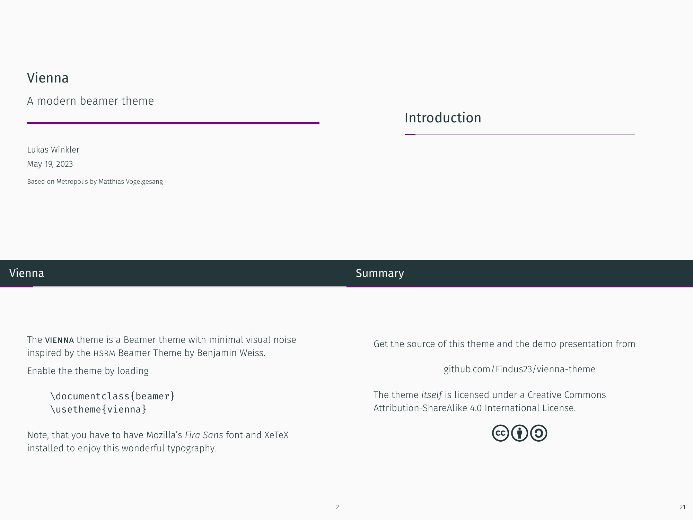

## Vienna Beamer Theme


This is a fork of the amazing [Metropolis Theme](https://github.com/matze/mtheme) by Matthias Vogelgesang.

Most changes here are inspired by the open PRs in https://github.com/matze/mtheme/pulls or adaptations I use in my presentations.


---

Vienna is a simple, modern Beamer theme based on [Metropolis](https://github.com/matze/mtheme) suitable for anyone to use. It tries
to minimize noise and maximize space for content; the only visual flourish it
offers is an (optional) progress bar added to each slide. The core design
principles of the original Metropolis theme were described in a blog post
[here](http://bloerg.net/2014/09/20/a-modern-beamer-theme.html).

Not convinced? Have a look at the [demo slides][] or read the [manual][].




## Installation

To install a stable version of this theme, please refer to update instructions
of your TeX distribution. 

Installing Vienna from source, like any Beamer theme, involves four easy
steps:

1. **Download the source** with a `git clone` of the [Vienna repository](https://github.com/Findus23/vienna-theme)
   or as a [zip archive](https://github.com/Findus23/vienna-theme/archive/master.zip) of
   the latest development version.
2. **Compile the style files** by running `make sty` inside the downloaded
    directory. (Or run LaTeX directly on `source/viennatheme.ins`.)
3. **Move the resulting `*.sty` files** to the folder containing your
   presentation. To use Vienna with many presentations, run `make install`
   or move the `*.sty` files to a folder in your TeX path instead.
4. **Use the theme for your presentation** by declaring `\usetheme{vienna}` in
    the preamble of your Beamer document.
5. **For best results** install Mozilla's [Fira Sans](https://github.com/bBoxType/FiraSans).


## Usage

The following code shows a minimal example of a Beamer presentation using
Vienna.

```latex
\documentclass{beamer}
\usetheme{vienna}           % Use vienna theme
\title{A minimal example}
\date{\today}
\author{The Author}
\institute{Centre for Modern Beamer Themes}
\begin{document}
  \maketitle
  \section{First Section}
  \begin{frame}{First Frame}
    Hello, world!
  \end{frame}
\end{document}
```

Detailed information on using Vienna can be found in the [manual][].


## License

The theme itself is licensed under a [Creative Commons Attribution-ShareAlike
4.0 International License](https://creativecommons.org/licenses/by-sa/4.0/). This
means that if you change the theme and re-distribute it, you *must* retain the
copyright notice header and license it under the same CC-BY-SA license. This
does not affect the presentation that you create with the theme.


[demo slides]: https://lw1.at/s/vienna-theme/demo.pdf
[manual]: https://lw1.at/s/vienna-theme/viennatheme.pdf
